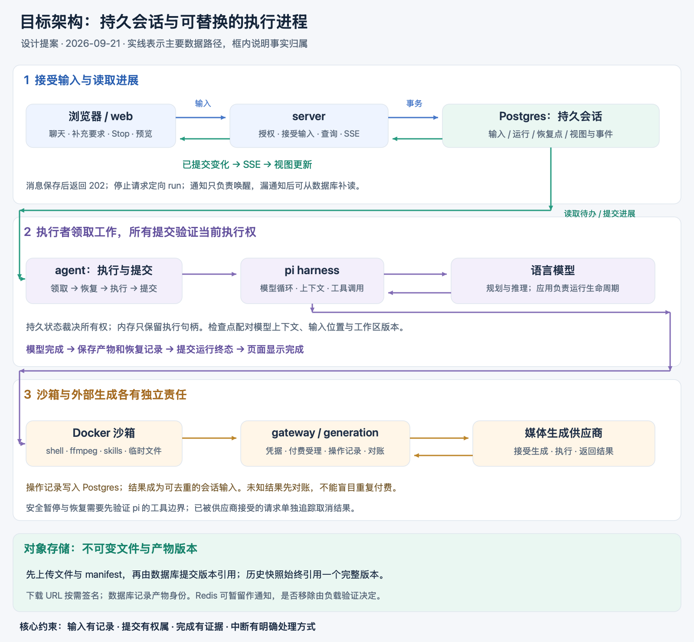

# 让聊天与长任务共用一套清晰的事实

状态：早期设计讨论，部分方案已被替代，尚未实施。基于提交 `6a7cd59` 的代码审阅；公开资料检索日期为 2026-09-21。

更新：当前推荐方案以 [四应用目标架构](./2026-09-21-four-app-architecture.md) 为准。保留独立 agent，server 与 agent 分别拥有产品记录和执行记录，通过可靠命令与结果事件协作。下文的目录、跨应用写入和提交路径不是当前定稿；持久输入、所有权和恢复问题仍需按新版归属落实。

## 1. 判断与设计目标

项目已有值得保留的结构：HTTP 服务与后台执行分离，模型循环与沙箱分离，媒体凭据放在网关，skills 用文件与 shell 表达能力。四个进程各有真实的部署或信任边界。

主要欠缺是跨越这些进程后，谁有权认定一个事实。例如：消息已经接受了吗？补充要求真的进入模型上下文了吗？运行已经结束了吗？生成请求是否已经花钱？文件与模型记忆是否属于同一次提交？

建议把设计中心放在**持久会话**上：输入先记录，执行者临时领取处理权，进展提交后才成为公开事实。代码审美的验收标准是：每个事实有唯一负责人，每个中断点有明确结果，每个新增抽象能删除一组现有的特殊处理。

本提案面向当前单区域、低并发、自有 Docker 沙箱与 Postgres 的部署。默认并发配置为 3；这不等于实测负载或未来容量。高吞吐需求需要单独验证。

## 2. 同类产品提供了什么证据

下面是公开架构与文档所陈述的能力，不推断未公开的产品内部实现，也不把平台承诺直接套用到我们的代码。

| 参考                                                                                                                 | 公开设计                                                           | 对本项目的启发                                                    |
| -------------------------------------------------------------------------------------------------------------------- | ------------------------------------------------------------------ | ----------------------------------------------------------------- |
| [Anthropic Managed Agents，2026-04-08](https://www.anthropic.com/engineering/managed-agents)                         | 会话记录、harness、沙箱分别建模；执行循环持续写入外部会话记录      | 保留现有 harness / sandbox 分离，把会话持久性从执行进程中独立出来 |
| [LangSmith data plane](https://docs.langchain.com/langsmith/data-plane)                                              | Postgres 保存 threads、runs、checkpoints；Redis 用于通知与暂态协调 | 接受输入与运行状态应能从数据库解释；通知丢失不应丢失工作          |
| [LangChain production deep agents，2026-04-20](https://www.langchain.com/blog/runtime-behind-production-deep-agents) | 区分 harness 与 runtime；运行中再次输入有明确的并发策略            | 把补充要求如何进入运行写成产品规则，并由持久状态保护              |
| [Cloudflare durable execution](https://developers.cloudflare.com/agents/runtime/execution/durable-execution/)        | 持久运行元数据、显式快照与恢复回调；恢复策略仍需应用定义           | 恢复点与重试政策必须具体，不能用“支持 durable”代替说明            |
| [Inngest durable agents](https://www.inngest.com/docs/learn/durable-agents)                                          | 用持久步骤、等待事件与步骤结果复用组织 agent 工作                  | 外部生成和人类回复可以成为有记录的等待条件                        |
| [Trigger.dev wait](https://trigger.dev/docs/wait)                                                                    | 支持等待与执行快照；停止计算计费和释放并发有不同条件               | 等待时释放资源是一项实际运行能力，需要验证其边界                  |

这些资料共同支持“会话持续存在，执行实例可以替换”的方向。选择 Postgres 收拢本项目的状态，是结合现有规模做出的设计判断；公开资料没有证明它一定优于所有 Redis 或工作流引擎方案。

## 3. 当前复杂度集中在哪里

| 当前位置                                                                                   | 实际边界                                                          | 目标责任                                                 |
| ------------------------------------------------------------------------------------------ | ----------------------------------------------------------------- | -------------------------------------------------------- |
| [routes.ts](../../apps/server/src/api/routes.ts)                                           | 发消息时写队列；用户消息由 agent 后续保存                         | API 在事务内接受输入并保存用户可见记录                   |
| [main.ts](../../apps/agent/src/main.ts)、[in-flight.ts](../../apps/agent/src/in-flight.ts) | 依赖进程内映射决定新运行或 steer；steer 排入 Promise 链后即返回   | 会话收件箱记录输入归属与处理进度；内存只保留当前执行句柄 |
| [redis-queue.ts](../../packages/queue/src/redis-queue.ts)                                  | 工作槽满时停止取消息，补充要求共用这条队列                        | 接受与投递控制输入独立于分配新执行槽                     |
| [turn.ts](../../apps/agent/src/turn.ts)                                                    | 恢复工作区后才 claim；模型结束后先 release，再保存 session 和文件 | 从读取旧版本前到最终提交，全程验证执行所有权             |
| [pi.ts](../../apps/agent/src/harness/pi.ts)                                                | 模型循环先发 RUN_FINISHED，应用稍后持久化                         | 会话执行规则决定产品运行何时完成                         |
| [delivery.ts](../../apps/agent/src/delivery.ts)                                            | 分别发布实时事件和写历史                                          | 公开视图及其增量在同一数据库事务中提交                   |
| [workspace.ts](../../apps/agent/src/workspace.ts)                                          | 同一前缀覆盖文件；session 与文件分别保存                          | 用不可变文件版本和数据库引用共同定义恢复点               |
| [generate-clip](../../skills/generate-clip/SKILL.md)                                       | 外部任务 ID 保存在沙箱文件，响应丢失时不能确定是否已提交          | 可信执行边界持有生成操作记录与对账责任                   |

这些是架构层面的边界问题；用更多转发层、接口或目录解决不了。

## 4. 五个稳定名词

| 名词                  | 含义                                             | 生命周期                   |
| --------------------- | ------------------------------------------------ | -------------------------- |
| Conversation / thread | 用户持续讨论、修改同一项工作的空间               | 跨多次运行                 |
| Input                 | 用户消息、定向停止、生成完成通知等已经接受的输入 | 接受到确认应用             |
| Run                   | 为完成当前要求而进行的一次工作，包含等待与恢复   | 跨执行进程，可接收多个输入 |
| Operation             | 一次需要追踪结果的外部生成动作                   | 可长于发起它的执行实例     |
| Artifact              | 有身份、有版本的用户产物                         | 独立于沙箱与下载 URL       |

用户发一条消息，API 返回输入 ID。运行 ID 在分配运行时确定；运行中补充要求可以加入同一个 run。页面订阅 thread，因此不依赖一条消息必然对应一次运行。

Checkpoint 是一个恢复记录：模型上下文、已应用的输入位置、工作区版本、等待条件及执行环境版本。它属于 Run 的实现，不新增一个面对用户的业务概念。

## 5. 目标结构

本节图示为早期方案。当前应用、状态归属和消息路径已由 [四应用目标架构](./2026-09-21-four-app-architecture.md) 修订；agent 保持独立应用。



四个应用的职责保持集中：

- **web**：页面、聊天操作、事件归并和产物预览。
- **server**：认证授权、接受输入、查询会话、传输 SSE。
- **agent**：领取执行权、恢复上下文、驱动 harness 和沙箱、提交进展。
- **gateway**：持有媒体凭据、限制出站访问、接受和追踪媒体生成操作。

Postgres 保存输入、运行、操作记录、恢复点与公开视图；对象存储保存不可变文件。Redis 可以暂时保留为通知加速器。目标方案允许在负载验证后移除 Redis：通知只负责唤醒，定期查询负责补漏，数据库始终保存待处理事实。

这不是要求把所有 token、原始工具输出和调试轨迹永久写成事件溯源系统。公开视图事件是有限保留的传输日志；运行状态和检查点仍是直接可查询的记录。

## 6. 一条消息如何变成工作

1. server 验证权限，以客户端请求 ID 去重，在同一事务中写入 Input 和用户消息，再返回 202。相同 ID、不同内容是冲突；不能按文字内容去重。
2. 调度器读取待处理输入。空闲会话建立 run；正在运行的会话接收补充要求；正在等待的会话按等待条件恢复。输入归属由数据库事务裁决。
3. agent 在读取工作区和模型上下文之前领取租约。短事务锁定竞争记录，领取后释放数据库锁；模型调用期间不持有行锁。
4. agent 恢复一个已提交的检查点，驱动 pi 与沙箱，在安全边界应用新的输入。
5. 阶段完成后提交检查点和公开变化；遇到外部等待时记录等待条件，具备安全暂停能力后释放执行资源。
6. 所需产物与恢复记录提交成功，run 才进入成功终态，随后页面收到运行完成事件。

数据库可以使用 `FOR UPDATE SKIP LOCKED` 领取队列式工作，`LISTEN/NOTIFY` 用于唤醒。通知没有持久队列的语义，必须配合启动扫描、断线重连后的扫描与定期查询。参见 [Postgres SELECT](https://www.postgresql.org/docs/17/sql-select.html) 与 [NOTIFY](https://www.postgresql.org/docs/17/sql-notify.html)。

## 7. 运行中聊天与停止

同一会话最多有一个有权提交的活动 run。正常补充要求按顺序在下一个安全边界进入模型；结束提交阶段已经开始时，后到输入留给下一次运行。这个分界通过事务固定，不能依赖一次内存检查。

Stop 是定向某个 run 的持久控制输入，使用独立的高优先级读取路径。正在运行的 agent 不需要等待空闲执行槽才能收到它。Stop 请求被记录只代表“已接受”，实际中止结果由运行状态报告。

需要区分两种确认：输入已保存、输入已应用。`steer()` 返回不自动证明它已经进入可恢复的上下文。只有输入位置和包含它的检查点一起提交，恢复时才可以认为它已应用。

过期 Stop 不影响后来的 run。停止之后到达的外部生成结果仍被记录，是否继续使用由会话规则决定。对已经被供应商接受的请求，只有供应商支持并确认取消时，才能宣称生成也已停止。

Run 的持久状态至少需要区分排队、运行、等待、成功、失败、取消；等待携带具体原因，故障携带具体恢复方式。准备和提交阶段是否单独落库，取决于输入路由与恢复所需事实，不为画图增加状态。

## 8. 所有权、恢复与真实边界

租约包含递增的执行代次。提交检查点、公开产物和最终状态必须验证当前代次，失去租约的实例失去提交权。进程内的 Map 可以用于寻找执行句柄，但不裁决全局所有权。

租约过期不能保证旧进程已经停止，更不能自动阻止它调用外部服务。因此：

- 文件写到不可变版本路径，当前版本引用由有权提交的一方更新。
- 新的付费操作由可信网关校验有效执行身份与当前授权，再持久记录受理事实。
- Stop 与付费操作受理之间定义数据库顺序：Stop 生效后拒绝新受理；此前已受理的操作单独追踪。
- 外部调用成功但本地没有收到响应时保留“结果未知”，不猜测失败，不自动重复付费。

自动恢复只适用于已经验证安全的边界。可验证的计算可以重做；不确定的外部动作先对账。初期无法恢复的运行应明确标记中断并展示已有产物，不能立即把整轮重新执行包装成恢复能力。

## 9. 三个必须讲清的提交边界

本节保留一致性问题的分析。当前 agent 提交执行事实，server 消费结果并提交产品视图，二者通过 outbox/inbox 协作，不共享一次跨应用数据库事务；外部生成职责也需按新版应用边界细化。

### 9.1 公开视图与 SSE

公开变化先在事务中写入视图和事件记录，然后 SSE 读取已提交的事件。每个会话有单调游标；同一会话的游标分配与提交通过行级串行化保持一致，不能把任意全局自增 ID 当作提交顺序。

首次连接在一致性读取中得到 snapshot 和 cursor，之后只读取更大的 cursor。重连重放，客户端丢弃重复游标；保留期外的游标重新取快照。签名下载链接在读取时生成，不作为长期事实保存。

流式文本可以按短时间窗合并写入，具体批量大小由延迟和写放大测试决定。尚未提交的文本可能在崩溃时丢失，UI 不能把它宣称为已经保存。原始推理和工具调试输出不默认进入公开日志。

AG-UI 继续承担浏览器传输协议。pi adapter 报告模型与工具观察结果；应用运行规则负责生成 RUN_STARTED、RUN_FINISHED 等产品生命周期事件。只抽取当前真正需要的内部观察类型，不创建通用 agent 事件框架。

### 9.2 工作区与模型上下文

先上传不可变文件和 manifest；上传成功后，在数据库事务中一起提交 manifest 引用、模型检查点、输入应用位置和相应运行状态。引用提交前的孤立对象由延迟清理回收。

文件删除通过下一份 manifest 表达；不能只把存在的文件覆盖上传。恢复始终读取一对已提交的上下文和工作区版本。skills 版本、沙箱镜像版本也写入恢复记录。

流式聊天更新不要求每次复制工作区；只有明确的恢复边界提交一致的文件与模型记录。已经展示的阶段性产物也需要先上传成功，再提交有版本的产物引用。

### 9.3 外部生成

网关先记录操作意图，再调用供应商。支持幂等键时使用稳定 operation ID；不支持时保留请求状态和对账资料，响应不明时进入未知状态。轮询或 webhook 结果持久化后，以去重的输入通知会话。

Operation 的提交与结果归 gateway 负责。恢复轮询可以先由 gateway 的受控后台循环承担，不必新增部署服务；规模需要时再把相同职责搬到单独进程。

skills 继续通过 shell 使用生成能力。只是付费提交与结果追踪进入可信网关，不再仅依赖沙箱里的 `.jobs` 文件。任意原始付费 API 旁路如果仍可调用，就不能承诺统一的去重与停止规则。

## 10. 目录：按事实归属组织，按部署边界组装

本节目录方案已被 [四应用目标架构](./2026-09-21-four-app-architecture.md) 替代，不作为重构目标；保留原文仅用于理解提案演进。

下面是目标责任地图，不是要求立即建立每个文件，也不是已存在的 API。

```text
apps/
  web/src/conversation/          # 显示会话与应用服务端增量
  server/src/api/                # 权限、HTTP、SSE
  agent/src/
    execution/                  # 恢复、执行、暂停与提交的应用流程
    harness/                    # 消费方需要的最小合同与 pi 实现
    sandbox/                    # 消费方需要的最小合同与 Docker 实现
  gateway/src/                  # 可信出站边界与供应商适配

packages/
  conversation/src/
    accept-input.ts             # 接受、去重与记录用户输入
    claim-run.ts                # 租约与同会话竞争
    apply-input.ts              # 输入分配、应用确认与停止规则
    commit-progress.ts          # 检查点、公开视图与运行状态提交
    read-conversation.ts        # 一致性快照与增量查询
  generation/src/               # 外部生成操作的身份、状态与对账规则
  workspace/src/                # 文件版本、manifest、对象存储与产物访问
  contract/src/                 # 公开协议 schema；类型由 schema 推导
  turn-token/src/               # 现有凭据支持包，随运行身份语义再评估命名

skills/                         # 面向模型的能力说明与脚本
```

conversation 被 server 和 agent 使用；generation 被 gateway 及需要查询操作的执行流程使用；workspace 被执行器和产物查询使用。这些共享包都有实际消费者。

规则函数与相应数据库实现就近组织，SQL 集中在各包具名的持久化模块。一个事务对应一个实际业务提交边界，避免把事务拆成数个彼此不知道的 repository 调用。仅含转发的接口和 service 层不建立。

依赖由应用组装指向这些包；包不反向导入 apps。conversation 只保存工作区版本和生成操作的身份引用，不驱动 Docker 或供应商。跨边界动作由应用流程组合，跨表必须原子提交的会话事实归 conversation 统一负责。

`packages/store` 和 `packages/queue` 逐步按上述职责收拢。先移动行为和消费者，删除旧路径，再移动文件；目录美化不单独成为一次没有行为收益的大重构。

## 11. TS 与代码美学的具体约束

- 区分输入、运行、外部操作的 ID；相邻不透明 ID 使用命名参数，重要边界可用品牌类型防串用。
- 状态用判别联合表达，例如等待携带等待原因；避免 `done`、`cancelled`、`waiting` 多个布尔量组合。
- 沙箱产物路径、已存储对象键、下载 URL 是三个不同事实；仅在产生新事实的边界转换，不让一个 `url` 字段承担三种意义。
- pi 检查点保持格式封装，但记录格式及版本，读入时由 pi adapter 校验。不宣称不同 harness 的上下文可以直接互换。
- Zod 等 schema 只在外部输入边界解析，类型从 schema 推导；不为同一内部事实反复验证。
- 顶层流程读起来应是领取、恢复、执行、提交、清理；每个动词背后都有独立的错误责任。
- 释放沙箱、注销监听与 dispose 使用生命周期清理路径；保存失败不应跳过清理，也不应被清理失败覆盖。
- 注释写约束与理由。现有 code-style 文档仍有“没有数据库 / 没有 web UI”的过时描述，实施时同步清除，以代码与有效检查为准。

## 12. 自己实现多少，何时引入成熟运行时

当前建议先做范围受限的会话执行能力：持久输入、单会话租约、明确的提交边界、显式等待与结果对账。Postgres 合并部分职责有机会减少部署与双写复杂度，但我们仍要承担租约、恢复、保留期、轮询和数据库负载的维护成本。

不要在项目里逐步重造通用工作流引擎。如果需要任意步骤重放、复杂并行图、跨天定时、大量等待任务、版本迁移与完整运维面板，优先评估成熟运行时，验证它与 Bun、pi、Docker 及部署环境的适配，再选择。把整个 pi 循环包成一个可重试任务，仍不能提供工具级的安全恢复。

Redis 是否移除由一次真实负载测试决定；PG 写入延迟、事件保留成本与数据库连接数不达标时，Redis 可以继续做通知或流传输，持久事实与事务边界仍保持上述设计。

## 13. 迁移顺序与完成证据

| 顺序 | 交付                                                   | 删除或收拢的复杂度                         | 必须证明                                                         |
| ---- | ------------------------------------------------------ | ------------------------------------------ | ---------------------------------------------------------------- |
| 1    | 持久 Input / Run；API 事务接受消息；完成状态归执行规则 | 消息只存在队列、模型先宣布产品完成         | API 返回后立即杀进程，输入仍可见；保存失败不能显示成功           |
| 2    | 租约、执行代次、定向控制输入与输入确认                 | 内存 Map 的全局权威、易丢的停止广播        | 两个 agent 竞争只产生一个有效提交；满负载仍能接收 steer / Stop   |
| 3    | 不可变工作区版本与配对检查点                           | session 和文件各自保存、覆盖旧版本         | 在上传与数据库提交之间崩溃，恢复仍读取完整旧版；删除文件不会复活 |
| 4    | 公开视图与事件同事务，snapshot + cursor                | 历史与事件双写、前端补偿性重放判断         | 快照和新事件并发发生仍无缺口；重连重复事件不重复展示             |
| 5    | 持久外部操作；验证并实现安全暂停与恢复                 | 沙箱脚本独自保管付费任务、等待占用执行资源 | 提交响应丢失不盲目再付费；等待恢复不重复应用输入                 |

每阶段由一条路径拥有写入权；迁移用回填、切换与核对完成，避免长期保留两套活跃状态机。

在承诺自动恢复之前必须完成两个小型验证：

1. **pi 暂停边界**：现有接口有事件订阅、steer 和 abort，但本项目尚未证明可以在任意工具边界获得可恢复检查点。验证输入确认、未完成工具调用、compaction 和待投递输入的恢复，不能把 abort 直接当作可靠挂起。
2. **数据库事件负载**：使用预期并发、长文本输出与重连比例，验证批量写入的延迟和存储增长。每个 SSE 连接不能独占一个数据库轮询连接；进程内共享读取和唤醒。

还要覆盖：旧执行者迟到提交、旧 Stop 到达新 run、供应商回调重复或晚到、对象存储暂时不可用、清理失败与原始失败同时发生。测试断言用户可见结果与持久事实，不把目录结构和函数调用顺序当作架构质量。

## 14. 最终应能回答的四句话

1. 用户的要求一经接受，就有持久记录和明确处理状态。
2. 当前运行的每次提交，都能说明谁有权提交、基于哪个恢复点。
3. 页面展示的完成、产物与历史，都能追溯到已提交事实。
4. 进程死亡、网络断开或供应商结果未知时，系统知道如何继续，或明确知道为什么不能继续。

实现这些承诺，并能沿一条普通代码路径读懂它们，才是本项目值得追求的架构美感。
